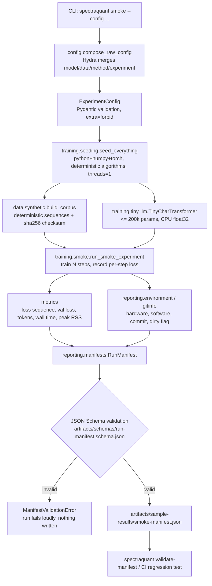

# System architecture

Status: bootstrap (Milestone 0). This document describes the *shape* of the repository and the data
flow of a run. It does not describe compression methods — those arrive in later milestones and are
currently unimplemented by design (see the placeholder inventory at the end).

## 1. Two layers, one boundary

The repository deliberately separates **research claims** from **executable evidence**.

| Layer | Paths | Written by | Purpose |
|---|---|---|---|
| Research | `docs/research/**`, `references/**` | research stream | question, preregistration, literature, novelty risk, risk register, upstream lockfile |
| Protocol | `docs/protocols/**`, `docs/coordination/**` | protocol/orchestration streams | measurement taxonomy, path ownership, decision log |
| Evidence | `src/**`, `configs/**`, `artifacts/**`, `tests/**` | infra + method streams | what actually executed and what it produced |
| Narrative | `reports/**`, `notebooks/final/**` | reporting stream | figures, tables, paper text |

The boundary is the **run manifest**. Research documents say what will be claimed; a manifest says
what ran. Nothing may be reported as a result unless a manifest exists for it, and every number in a
manifest carries a measurement class (AGENTS.md section 5). A claim with no manifest is a plan, not
a finding.

## 2. Module responsibilities

```
src/spectraquant/
├── config.py          typed composition of Hydra config groups (Pydantic, extra="forbid")
├── paths.py           repo-root discovery + standard directories (schemas, sample results)
├── data/              corpora: deterministic synthetic LCG sequences (Tier 0 fixture)
├── factorization/     low-rank decomposition API                      [M2 placeholder]
├── quantization/      fake-quantize / pack / dequantize API            [M2 placeholder]
├── proxies/           output-aware sensitivity proxies (M2: implemented)
├── allocation/        layer-wise rank & bit-width allocator            [M4 placeholder]
├── regularizers/      rounding-aware spectral preparation objective     [M5: implemented]
├── training/          seeding, smoke-fixture transformer, smoke runner, factorized
│                     linear carrier, preparation loop (checkpoint/resume, manifests)
├── evaluation/        Tier-0 toy fixtures + ground truth (M2: implemented); harness API [M6 placeholder]
├── benchmarking/      analytical memory + latency API                  [GPU-gated placeholder]
├── reporting/         logging, git provenance, environment capture, run manifests
└── cli/               Typer application: env, smoke, validate-manifest
```

Rules that hold across all modules:

* **Shapes, dtypes, devices and assumptions are documented** in every core function docstring.
* **Approximations are labelled** in code and prose (AGENTS.md section 4.13).
* **Unimplemented milestones raise `NotImplementedError`** naming the milestone and owner. An empty
  module never pretends to be a method.
* **Determinism is a module-level concern**, not a per-experiment hack: `training/seeding.py` is the
  only place RNG state is configured.

## 3. Data flow of a run



Two properties of this flow are load-bearing:

1. **The manifest is written last and validated first.** `write_manifest` validates the document
   before it touches the filesystem, so an invalid manifest can never exist on disk.
2. **A run that produces numbers without a class is refused.** The validator rejects
   `measurement_class: null` whenever `compression.method != "none"`, which is how the taxonomy is
   enforced mechanically rather than by good intentions.

## 4. Determinism

| Concern | Mechanism | Test |
|---|---|---|
| Python/NumPy/torch RNG | one seed in `seed_everything` | `tests/unit/test_seeding.py` |
| Kernel nondeterminism | `torch.use_deterministic_algorithms(True)` raises instead of drifting | same |
| Parallel float reductions | `torch.set_num_threads(1)` | same |
| Corpus identity | seeded permutation + `sha256` over raw bytes, recorded in the manifest | `tests/regression/test_sample_manifest.py` |
| Loss sequence identity | full sequence + digest recorded; two runs compared | `tests/integration/test_smoke.py` |
| Provenance | git commit + dirty flag + resolved config in every manifest | `tests/unit/test_manifest.py` |

`PYTHONHASHSEED` is exported for child processes; it cannot change hashing in an already-running
interpreter, and the code documents that rather than implying otherwise.

## 5. Configuration and the CLI

Hydra composes four groups — `model`, `data`, `method`, `experiment` — and Pydantic validates the
resolved tree. Unknown keys are errors, so a typo fails at startup rather than silently doing
nothing. The CLI is the only supported entry point for recorded runs:

| Command | Guarantee |
|---|---|
| `spectraquant env` | reports the resolved device, hardware and versions; states which measurement classes are obtainable here |
| `spectraquant smoke` | runs the CI smoke fixture (Tier 0) and writes a schema-valid manifest |
| `spectraquant validate-manifest PATH` | non-zero exit for any schema or semantic violation |

## 6. Placeholder inventory (Milestone 2+)

Every module below exists so that interfaces, ownership and imports are stable, and every entry
point raises `NotImplementedError` with its milestone and owner:

| Module | Milestone | Owner stream |
|---|---|---|
| `quantization/{fake_quant,packing}.py` | M2 | quantization |
| `factorization/decomposition.py` | M2 | factorization |
| `proxies/{base,variants,operators,gain,analysis}.py` | M2 (implemented) | proxy |
| `allocation/allocator.py` | M4 | allocation |
| `evaluation/harness.py` | M6 | evaluation |
| `benchmarking/measurement.py` | wave 2 / kernel-gated | benchmarking |
| `cloud/**` (absent: wave-2 slice) | — | cloud adapter |

Two Milestone-5 modules left this table when their slice landed: `regularizers/spectral.py`
(the rounding-aware preparation objective) and `training/loop.py` together with
`training/low_rank.py` (the Tier-0-capable preparation loop and its factorized linear
carrier). `evaluate_language_model` inside `training/loop.py` still raises: it needs the
Milestone-6 corpus loaders. Tier-1+ *training* remains cloud-substrate work
(`AGENTS.md` sections 2.3/2b) even though the loop itself runs.

`benchmarking.measure_inference_latency` is a special case: it raises not because the milestone has
not landed but because a latency number would be a fabricated class 4/5 claim on a CPU-only machine
(ADR-0002).

## 7. Testing and CI

| Layer | Location | What it protects |
|---|---|---|
| Unit | `tests/unit/` | config composition/validation, seeding determinism, manifest schema accept/reject, CLI surface |
| Integration | `tests/integration/` | the committed smoke experiment: two runs, identical losses, valid manifests |
| Regression | `tests/regression/` | the committed sample manifest still validates and is internally consistent |

CI (`.github/workflows/ci.yml`) runs ruff, ruff-format, pyright, pytest, a fresh smoke run and
manifest validation on Linux with the CPU PyTorch wheel. `security.yml` is an advisory dependency
audit; `docs.yml` blocks on required documents and checks links advisably.
